# 2024.06.28

> 1. 开发环境搭建：使用野火鲁班猫2IOBI开发板进行开发。连接12V供电，网口，串口，mipi屏。如下：
>    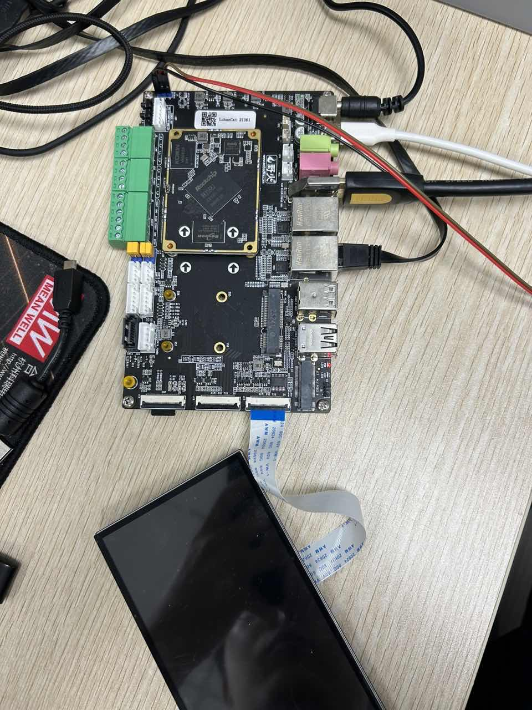
>
> 2. 烧录镜像：该开发板有两种烧录模式，emmc烧录和sd烧录。
>
>    由于之前使用过树莓派，更习惯使用sd烧录。
>
>    2.1 镜像获取：使用官方资料里的ubuntu20.04镜像（由于文件大要到官方资料里下载）
>
>    ```
>    lubancat-rk3568-ubuntu20.04-xfce-full-20240510_update.img
>    ```
>
>    2.2镜像烧录：SDDiskTool文件里的烧录工具 SD_Firmware_Tool.exe 和SDCardFormatter里的SD 卡格式化工具 SDCardFormatter
>
>    2.2.1先格式化SD卡
>
>    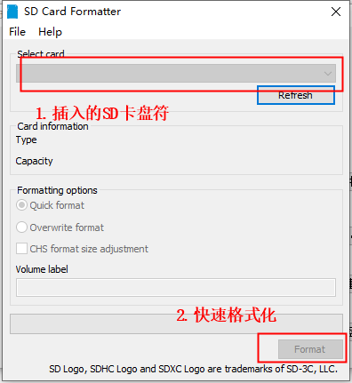
>
>    2.2.2烧录镜像
>
>    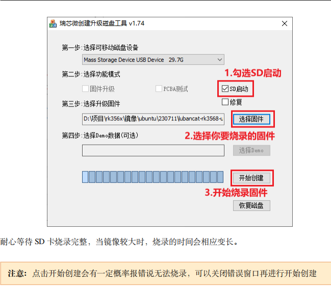
>
>    3.启动系统
>
>    官方文档说是默认开了HDMI 实际是没有开，HDMI目前测试是不可以用的。
>
>    3.1先使用的是ssh连接（局域网同网段），这种方式只适合不知道板卡IP时使用。
>
>    打开 MobaXterm 软件, 点击图标 sessions 即可弹出 session setting，选择 SSH。
>
>    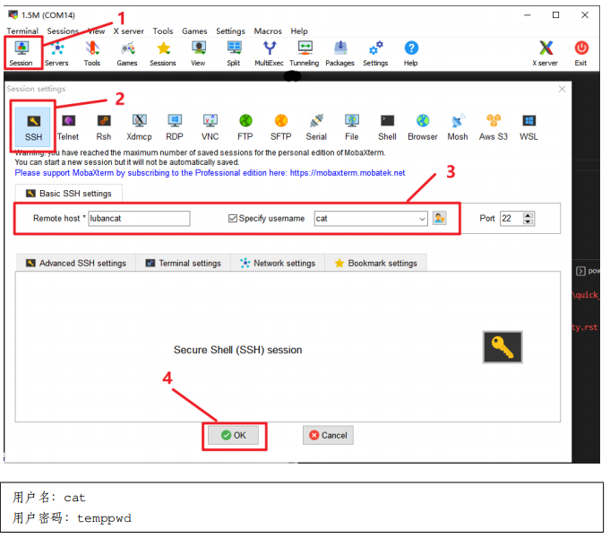
>
>    输入正确后就会看到下面的场景
>
>    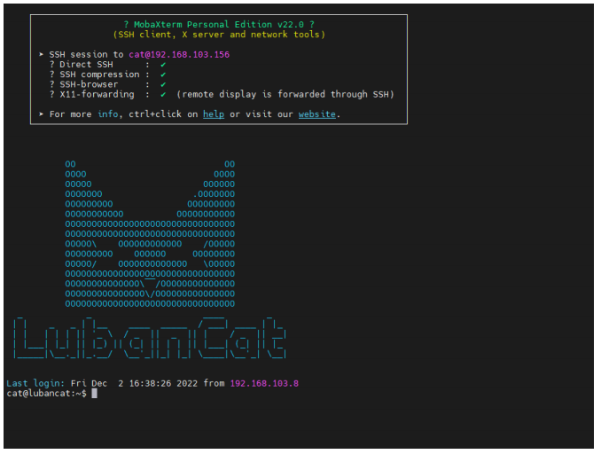
>
>    3.2 远程桌面配置：使用VNC
>
>    3.2.1安装VNC服务
>
>    ```
>    sudo apt install x11vnc
>    ```
>
>    3.2.2创建连接密码
>
>    ```
>    x11vnc -storepasswd
>    ```
>
>    使用 cat 用户创建 VNC 连接密码，密码默认保存在/home/cat/.vnc/passwd 文件中
>
>    3.2.3 进行连接测试
>
>    ```
>    export DISPLAY=:0
>    ```
>
>    ```
>    x11vnc -auth guess -once -loop -noxdamage -repeat -rfbauth /home/cat/.vnc/passwd -rfbport 5900 -shared
>    ```
>
>    手动开启 VNC 服务，设置连接端口为 5900，如果端口被占用可以使用其他端口。
>    开启 VNC 服务以后，我们使用 MobeXterm 的 VNC 连接功能进行测试
>
>    3.2.4 设置VNC服务开机自启动
>
>    ```
>    sudo vim /etc/systemd/system/x11vnc.service
>    ```
>
>    新建文件，创建一个 x11vnc.service 的服务，在文件中输入以下内容
>
>    ```
>    [Unit]
>    Description=x11vnc (Remote access)
>    After=network-online.target
>    
>    [Service]
>    Type=simple
>    ExecStart=/usr/bin/x11vnc -auth guess -display :0 -rfbauth /home/cat/.vnc/passwd -rfbport 5900 -forever -loop -noxdamage -repeat -shared -capslock -nomodtweak
>    ExecStop=/bin/kill -TERM $MAINPID
>    ExecReload=/bin/kill -HUP $MAINPID
>    KillMode=control-group
>    Restart=on-failure
>    
>    [Install]
>    WantedBy=graphical.target
>    ```
>
>    文件创建成功以后，使用以下命令重新读取系统服务配置，将 x11vnc.service 加入系统服务并开
>    启
>
>    ```
>    sudo systemctl daemon-reload
>    ```
>
>    ```
>    sudo systemctl enable x11vnc
>    ```
>
>    ```
>    sudo systemctl start x11vnc
>    ```
>
>    3.2.5 PC端安装VNC客户端
>
>    在电脑端，我们可以安装 VNC Viewer 作为客户端来进行 VNC 连接。
>    下载地址：https://www.realvnc.com/en/connect/download/viewer
>
>    3.3使用NoMachine 软件
>
>    NoMachine 是一款远程桌面软件, 适用于 Linux、windows、ARM、Android 等几乎全系统。常见的
>    远程桌面软件还有向日葵、ToDesk 等。那么 NoMachine 与其他远程桌面工具有何区别呢？
>    最重要的因素就是速度。NX 协议在高延迟低带宽的链路上提供了近乎本地速度的响应能力。所
>    以，给人的感觉是好像你就在你的电脑跟前。其次是因为它支持鲁班猫的 ARM64 处理器。
>
>    3.3.1鲁班猫安装 NoMachine
>
>    鲁班猫安装 NoMachine 前，要先满足以下条件：
>    1. 鲁班猫系统必须是有桌面版本，如 xfce 版本和 xfce-full 版本。
>
>    2. 鲁班猫通过 HDMI 接口连接屏幕，并接上鼠标键盘，方便后续操作。
>
>    3. 鲁班猫板卡必须连接上互联网。
>      下面将以搭载 Ubuntu20.04 的鲁班猫板卡为例，演示一下 NoMachine 安装流程。
>
>    4. 获取安装包
>      对于安装包的拉取，一般都可以在终端输入 wget + 安装包下载链接实现, 如：
>
>      ```
>      wget https://download.nomachine.com/download/8.8/Arm/nomachine_8.8.1_1_arm64.deb
>      ```
>
>      安装：
>
>      ```
>      # 1. cd 到安装包下载目录
>      cd Downloads/
>      ```
>
>      ```
>      # 2. 下载的内容 mv 到/usr 文件夹
>      sudo mv nomachine_8.8.1_1_arm64.deb /usr/
>      ```
>
>      ```
>      # 3. 进入/usr 文件夹并安装
>      cd /usr/ && sudo dpkg -i nomachine_8.8.1_1_arm64.deb
>      ```
>
>      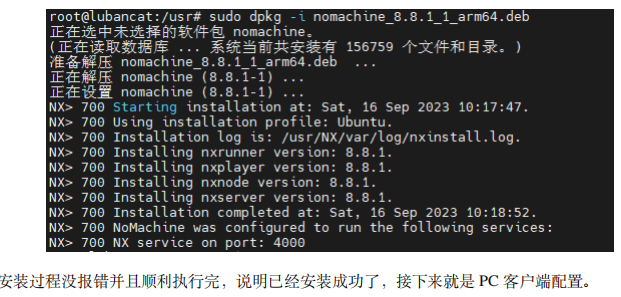
>
>      5.PC 端远程连接鲁班猫
>
>      NoMachine 启动后会自动扫描局域网内其他安装有 NoMachine 的设备，因为刚刚已经在鲁班猫上
>      安装了 NoMachine 服务端，所以主界面的设备列表会识别出鲁班猫板卡。如果没有，可以尝试点
>      击左上角 add 输入鲁班猫 IP 地址进行添加
>
>      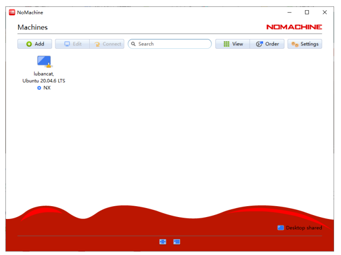
>
>      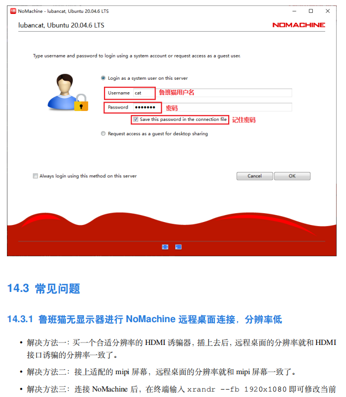
>
>      如果显示分辨率模糊
>
>      ```
>      xrandr --fb 1920x1080
>      ```
>
>      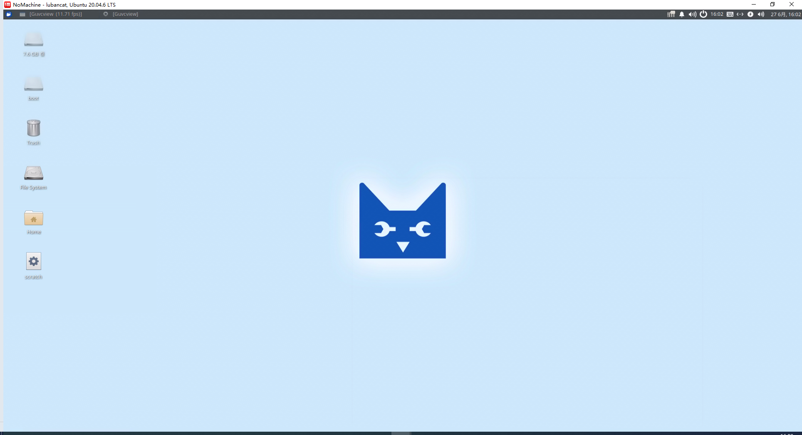
>
>      5.mipi屏显示：
>
>      ```
>      vim /boot/uEnv/uEnv.txt
>      ```
>
>      修改hdmi和mipi屏
>
>      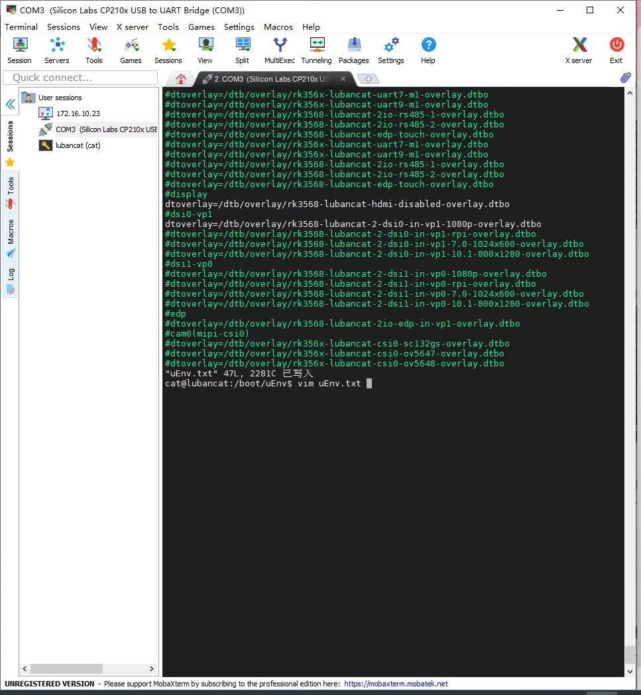
>
>      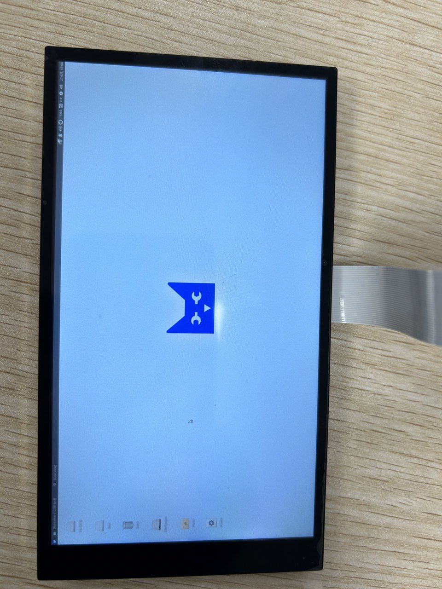
>
>      接usb摄像头测试：
>
>      ```
>       sudo apt update
>      ```
>
>      ```
>      sudo apt install guvcview
>      ```
>
>      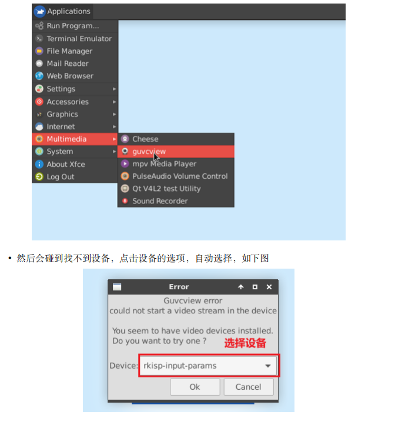
>
>      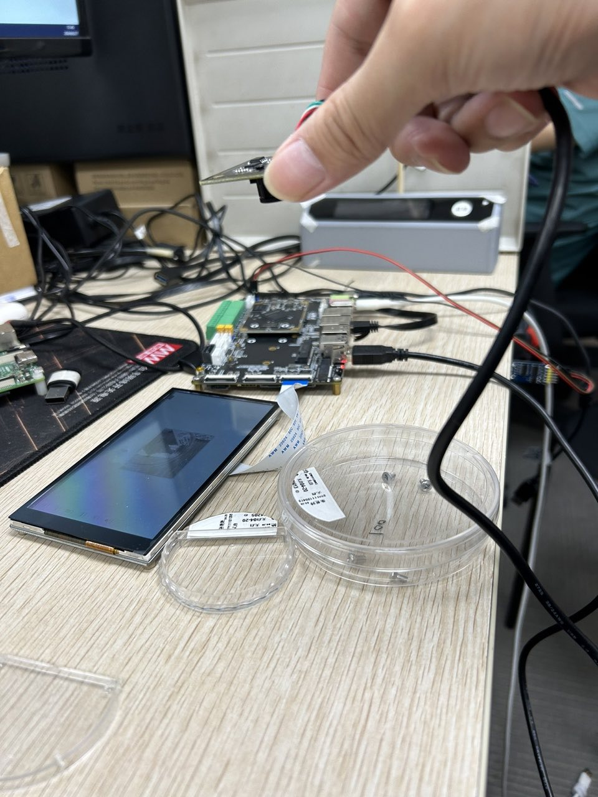
>
>      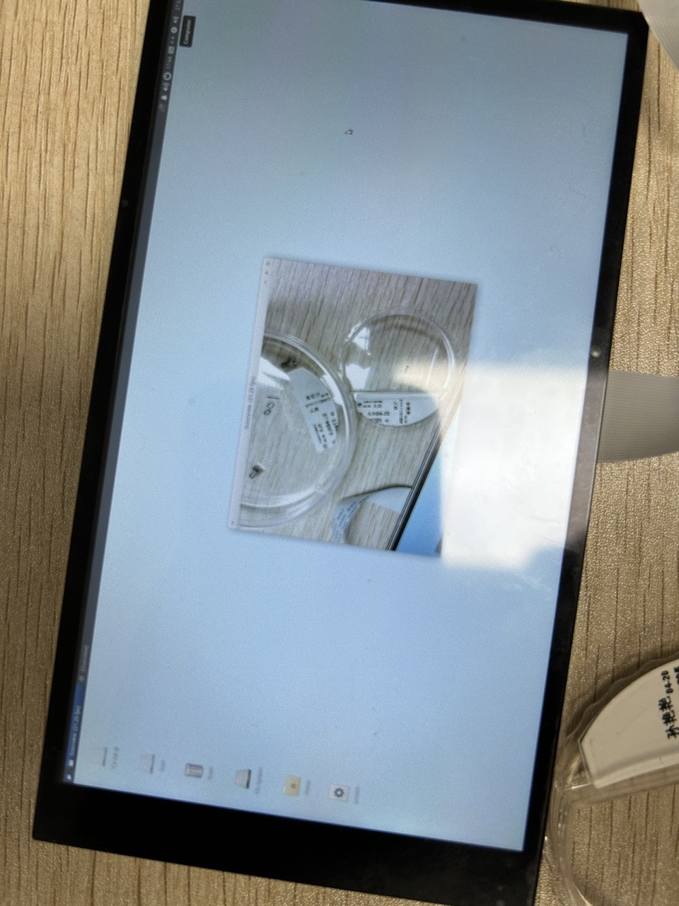

# 2024.06.28

> 图片检测
